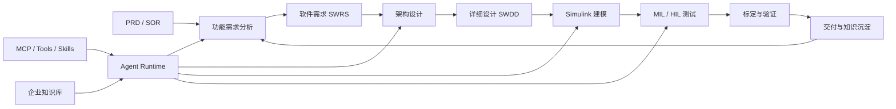

<!--
Profile README for https://github.com/suzike
Style: AI Native engineering console.
-->

<p align="center">
  
</p>

<p align="center">
  <a href="https://github.com/suzike">
    
  </a>
</p>

<p align="center">
  
  
  
  
  
</p>

---

## ENGINEERING CONSOLE

```text
> profile.boot
  Nanju / 南珠 / Suzike

> current_focus
  Automotive thermal management application software
  Smart HVAC Agent and intelligent cabin thermal comfort
  AI Native R&D platform for requirement, design, model, test, delivery

> toolchain
  MATLAB + Simulink + Model-Based Design + Agent + MCP + Knowledge Base

> build_principle
  production-oriented, document-driven, workflow-closed-loop
```

<p align="center">
  
</p>

## PRIMARY VECTORS

| Vector | What I am building | Engineering signal |
| --- | --- | --- |
| Automotive Thermal Management | 热舒适控制、热管理控制算法、智能座舱智慧空调场景 | 面向量产的软件需求、控制逻辑、MBD 开发与测试闭环 |
| Smart HVAC Agent | 智慧空调 Agent、自学习、个性化控制、AI 控制算法 | 结合 LSTM、离线强化学习、用户偏好学习与车端落地约束 |
| AI Native R&D Platform | 从 PRD/SOR 到需求、架构、详细设计、建模、测试、标定、知识沉淀 | 基于成熟大模型运行时与 Agent 能力构建企业级研发流程 |
| MATLAB/Simulink Workflow | MATLAB/Simulink Engine 嵌入、模型开发、脚本、MIL/HIL、文档自动化 | 类 IDE 内置聊天终端体验，多模型、多权限、多会话与上下文管理 |

## PRODUCT MAP



## FEATURED SYSTEMS

| System | Repository | Focus |
| --- | --- | --- |
| MATLAB/Simulink AI Sidecar | [matlab-simulink-copilot](https://github.com/suzike/matlab-simulink-copilot) | 把 AI 助手嵌入 MATLAB/Simulink 工作流，支持 Claude Code/Codex 后端 |
| MATLAB DeepSeek Copilot | [DeepSeekMatlabCopilot](https://github.com/suzike/DeepSeekMatlabCopilot) | 面向 MATLAB 工程研发的 DeepSeek Copilot 探索 |
| AI Training Platform | [AITrain_Platform](https://github.com/suzike/AITrain_Platform) | 预测模型训练、评估、推理与平台化流程 |
| TMS Agent Workflow | [tms-agent-workflow](https://github.com/suzike/tms-agent-workflow) | 面向 TMS、Simulink、SWDD 的多 Agent 工程任务编排 |
| AI Diagramming | [next-ai-draw-io](https://github.com/suzike/next-ai-draw-io) | 自然语言驱动 draw.io 图形创建、修改与增强 |
| Embedded Knowledge Base | [EmbedSummary](https://github.com/suzike/EmbedSummary) | 嵌入式工程资源与知识整理 |

## TECH RADAR

<p>
  
  
  
  
  
  
  
  
</p>

## SIGNAL METRICS

<p align="center">
  
  
</p>

<p align="center">
  
</p>

## OUTPUT STYLE

- 偏好能直接指导开发的工程化交付，而不是概念性介绍。
- 关注软件需求、详细设计、技术方案、开发任务、测试用例与可视化图示。
- 文档必须能进入真实研发流程: 结构清晰、按功能拆分、包含算法细节、数据流、工程约束与迭代路径。

## WATCHLIST

| Track | What I follow |
| --- | --- |
| Agent Engineering | Agent 产品化、Loop Engineering、企业 Skill/Tool/MCP 体系 |
| Automotive AI | 热管理、智能座舱、智慧空调、个性化控制、自学习算法 |
| Engineering Platforms | Polarion、Harness Engineering、需求到交付的研发闭环 |
| MBD Automation | Simulink 工具链、MIL/HIL 自动化、文档生成、测试生成 |

## CONTACT

- GitHub: [@suzike](https://github.com/suzike)
- WeChat Official Account: 林南橘
- Project discussions: open an Issue in the matching repository.

<p align="center">
  
</p>
