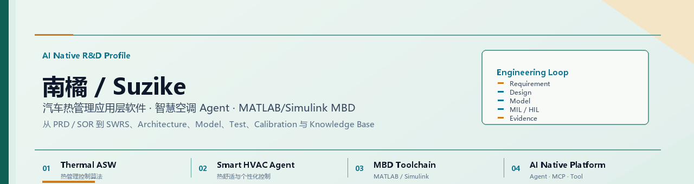
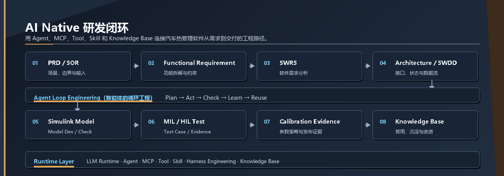

<!-- Profile README for https://github.com/suzike -->

  <picture>
    <source media="(prefers-color-scheme: dark)" srcset="./assets/profile-hero-dark.png">
    
  </picture>

## 核心定位

> [!IMPORTANT]
> 我目前聚焦 **汽车热管理应用层软件**、**MATLAB/Simulink MBD** 与 **AI Native 研发平台**。目标不是做概念 Demo，而是把 LLM、Agent、MCP、Toolchain 和 Knowledge Base 接入真实研发流程，形成从需求到交付的工程闭环。

我希望构建一套覆盖 `PRD/SOR`、`SWRS`、`Architecture`、`SWDD`、`Simulink Model`、`MIL/HIL`、标定、交付证据和 `Knowledge Base` 的平台，让 AI 能够参与需求分析、设计、建模、测试、验证和知识沉淀。

<table>
  <tr>
    <td align="center" width="25%"><b>Thermal ASW</b> 汽车热管理应用层软件</td>
    <td align="center" width="25%"><b>Smart HVAC Agent</b> 热舒适与个性化控制</td>
    <td align="center" width="25%"><b>AI Native R&amp;D</b> 需求到交付闭环</td>
    <td align="center" width="25%"><b>MATLAB/Simulink</b> MBD 工程工具链</td>
  </tr>
</table>

  <picture>
    <source media="(prefers-color-scheme: dark)" srcset="./assets/platform-loop-dark.png">
    
  </picture>

## 当前主线

<table>
  <tr>
    <td width="50%" valign="top">
      <b>01 / Thermal ASW</b> 
      热舒适控制、热管理控制算法、智能座舱场景。  
      <code>SWRS</code> <code>Control Logic</code> <code>Model Design</code> <code>Validation Evidence</code>
    </td>
    <td width="50%" valign="top">
      <b>02 / Smart HVAC Agent</b> 
      个性化控制、自学习、用户偏好建模、AI 控制算法。  
      <code>Agent Demo</code> <code>Data Flow</code> <code>Vehicle Constraints</code> <code>AI Control</code>
    </td>
  </tr>
  <tr>
    <td width="50%" valign="top">
      <b>03 / AI Native Platform</b> 
      从 PRD/SOR 到 SWRS、Architecture、SWDD、Model、Test、标定和 Knowledge Loop。  
      <code>Role</code> <code>Skill</code> <code>Tool</code> <code>MCP</code> <code>Knowledge Base</code> <code>SOP</code>
    </td>
    <td width="50%" valign="top">
      <b>04 / MATLAB/Simulink Workflow</b> 
      MATLAB/Simulink Engine 嵌入、Model 开发、Script、MIL/HIL、文档生成。  
      <code>Engine</code> <code>Context</code> <code>Permission Mode</code> <code>Automation</code>
    </td>
  </tr>
</table>

## 项目控制台

> [!NOTE]
> 项目分为三类：工程工具、AI 平台、热舒适 Agent 系统。这里优先展示能够支撑 AI Native 研发闭环的核心仓库。

<table>
  <tr>
    <td width="50%" valign="top">
      <b>[TOOL] MATLAB/Simulink AI Sidecar</b> 
      <a href="https://github.com/suzike/matlab-simulink-copilot">matlab-simulink-copilot</a> 
      将 AI Assistant 嵌入 MATLAB/Simulink Workflow。
    </td>
    <td width="50%" valign="top">
      <b>[TOOL] MATLAB DeepSeek Copilot</b> 
      <a href="https://github.com/suzike/DeepSeekMatlabCopilot">DeepSeekMatlabCopilot</a> 
      面向 MATLAB 工程研发的 DeepSeek Copilot 探索。
    </td>
  </tr>
  <tr>
    <td width="50%" valign="top">
      <b>[PLATFORM] AI 训练平台</b> 
      <a href="https://github.com/suzike/AITrain_Platform">AITrain_Platform</a> 
      AI 算法开发、训练、部署等全套研发可视化平台。
    </td>
    <td width="50%" valign="top">
      <b>[AGENT] Vehicle Thermal LLM MultiAgent</b> 
      <a href="https://github.com/suzike/Vehicle-Thermal-LLM-MultiAgent">Vehicle-Thermal-LLM-MultiAgent</a> 
      面向汽车空调热舒适的大模型驱动 Agent 智能系统。
    </td>
  </tr>
  <tr>
    <td width="50%" valign="top">
      <b>[VISUAL] AI 图形编辑</b> 
      <a href="https://github.com/suzike/next-ai-draw-io">next-ai-draw-io</a> 
      自然语言驱动图形创建与编辑。
    </td>
    <td width="50%" valign="top">
      <b>[KNOWLEDGE] Embedded Knowledge Base</b> 
      <a href="https://github.com/suzike/EmbedSummary">EmbedSummary</a> 
      嵌入式工程资源与知识整理。
    </td>
  </tr>
</table>

## 技术栈

<table>
  <tr>
    <td width="25%" valign="top"><b>MBD Layer</b>  <code>MATLAB</code> <code>Simulink</code> <code>Stateflow</code> <code>MIL/HIL</code></td>
    <td width="25%" valign="top"><b>Agent Layer</b>  <code>LLM Runtime</code> <code>Agent</code> <code>MCP</code> <code>Tool / Skill</code></td>
    <td width="25%" valign="top"><b>Software Layer</b>  <code>Python</code> <code>TypeScript</code> <code>Next.js</code> <code>GitHub Actions</code></td>
    <td width="25%" valign="top"><b>Engineering Layer</b>  <code>SWRS</code> <code>Architecture</code> <code>SWDD</code> <code>Calibration Evidence</code></td>
  </tr>
</table>

## 工程笔记

> [!TIP]
> 我更偏好能直接指导开发的工程化交付：软件需求、详细设计、技术方案、开发任务、Test Case、数据流、控制逻辑、验证计划和可复现脚本，而不是高层概念介绍。

  
<b>AI Native 研发平台蓝图</b>

   

平台底座应优先采用成熟的 LLM Runtime 和 Agent 能力，在其上构建企业自己的 Role、Skill、Tool、MCP Service、Knowledge Base 和 Agent Loop Engineering（智能体的循环工程），而不是重新实现底层 Agent Engine。

核心闭环：

1. PRD / SOR 输入
2. Functional Requirement 拆解
3. SWRS 分析
4. Architecture 与 SWDD
5. Simulink Model 与 Model Check
6. MIL/HIL Test Case 生成与结果分析
7. 标定证据与发布包
8. 知识沉淀与流程改进

  
<b>智慧空调 Agent 方向</b>

   

智慧空调 Agent 方向结合热舒适控制、个性化用户偏好学习、智能座舱场景和 AI 控制算法。工程落地需要同时关注车端约束、控制稳定性、标定工作量、验证证据和量产软件边界。

## 持续关注

<table>
  <tr>
    <td width="50%" valign="top"><b>Agent 工程</b> Agent 产品化、Agent Loop Engineering（智能体的循环工程）、MCP、企业 Skill/Tool 体系。</td>
    <td width="50%" valign="top"><b>汽车 AI</b> 智能座舱、热舒适、智慧空调、个性化控制、自学习。</td>
  </tr>
  <tr>
    <td width="50%" valign="top"><b>工程平台</b> Polarion、Harness Engineering（约束工程）、从需求到交付的研发闭环。</td>
    <td width="50%" valign="top"><b>MBD 自动化</b> Simulink Toolchain、MIL/HIL Automation、文档生成、Test Case 生成。</td>
  </tr>
</table>

## 联系

<table>
  <tr>
    <td width="33%" align="center" valign="top">
      <b>GitHub / Code</b> 
      <a href="https://github.com/suzike">@suzike</a> 
      代码、工具和工程实验。
    </td>
    <td width="33%" align="center" valign="top">
      <b>WeChat / Long-form</b> 
      林南橘 
      工程笔记、技术复盘、AI Native 研发平台思考。
    </td>
    <td width="33%" align="center" valign="top">
      <b>Issues / Collaboration</b> 
      Repository Issues 
      需求、Bug、方案讨论优先进入对应仓库。
    </td>
  </tr>
</table>

  Automotive Thermal Management · AI Native R&amp;D · MATLAB/Simulink MBD · Agent Engineering

