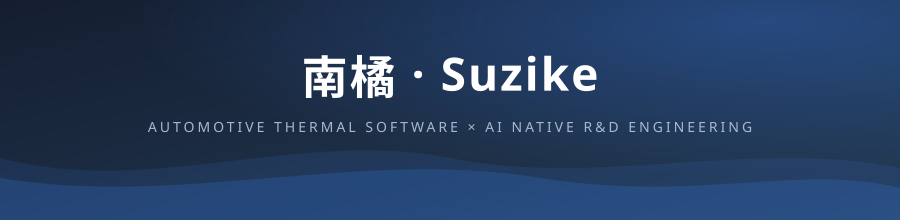
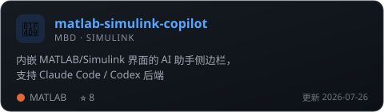
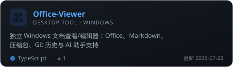
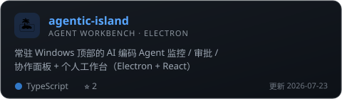
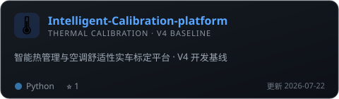

 

 

把 **LLM、Agent、MCP 与 Toolchain** 接入真实汽车软件研发流程 —— 从 PRD/SOR 到 SWRS、SWDD、Simulink Model、MIL/HIL 与交付证据的工程闭环。不做概念 Demo，只做可交付的工程化产出。

---

## 🎯 当前主线

| | 主线 | 在解决的问题 |
| :-: | :--- | :--- |
| 🌡️ | **智慧空调 Agent** | 热舒适控制 · 用户偏好自学习 · 车端量产约束 |
| 🧠 | **AI Native 研发平台** | PRD/SOR → SWRS → SWDD → Simulink → MIL/HIL → 标定证据 → 知识沉淀 |
| 📐 | **MBD 自动化** | Simulink 工具链内嵌 Agent · 多模型 Context · 脚本与文档自动生成 |

## 🚀 代表项目 · 按最近更新

  
  

  
  

## 🛠️ 技术栈

  
  
  
  
  
  
  

  
  
  

## 📊 数据

  

## 📮 联系

  
  
  

